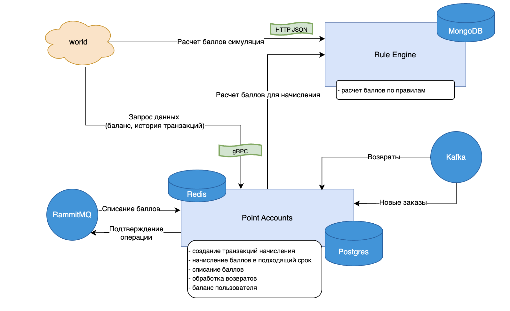
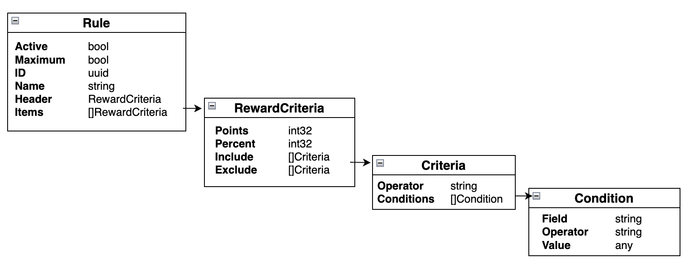

# Loyalty app

## Pet-проект на Golang - реализация Программы лояльности

Цель - получить опыт использования:

- Golang
- БД: PostgreSQL, MongoDB, Redis 
- брокеры: Kafka, RabbitMQ
- интеграция: HTTP, gRPC

 

Содержание:
  - [Схема проекта](#схема-проекта)
  - [Rule Engine](#rule-engine)
     - [Сервис "Rule Engine"](#сервис-rule-engine---движок-расчета-баллов)
     - [Структура подпроекта](#структура-подпроекта)
     - [Структура правил начисления](#структура-правил-начисления)
  - [Point Accounts](#point-accounts)
     - [Сервис "Point Accounts"](#сервис-point-accounts---баллы-лояльности)
     - [Структура подпроекта](#структура-подпроекта-1)

 

## Схема проекта

## Rule Engine

### Сервис "Rule Engine" - Движок расчета баллов

   - на вход HTTP-сервис получает JSON с заказом, возвращает количество баллов
   - в MongoDB хранятся правила расчета баллов (структура правил фиксирована, но конкретные условия могут быть созданы на любые поля)
   - структура заказа фиксирована: верхний уровень, внутри items, но набор полей на обоих уровней может быть любым, обязательное поле для заголовка: total (стоимость заказа), для item: price (стоимость позиции)

### Структура подпроекта

- [engine](engine/)
  - [cmd](engine/cmd/) — запуск сервера
  - [internal](engine/internal/)
    - [models](engine/internal/models/) — модель для правил
    - [services](engine/internal/services/) — логика расчёта
    - [interfaces](engine/internal/interfaces/) — объявления интерфейсов
    - [db](engine/internal/db/) — функции работы с MongoDB
    - [api](engine/internal/api/) — handlers

### Структура правил начисления

 - **Rule** struct { 
     - Active     	   - флаг активно/неактивно
     - Maximum	 - если установлен флаг, то данное правило конкурирует с другими Maximum и с суммой правил без				  Maximum, по итогу применяется правило с наибольшим кол-вом баллов
     - ID		       - идентификатор
     - Name		- наименование
     - Header     	 - стуктура R-критериев (RewardCriteria), применяется к заголовку заказа
     - Items       	  - массив R-критериев ([]RewardCriteria), применяются к позициям заказа
 }

 - **RewardCriteria** struct {
    - Points        	  - фиксированное кол-во баллов, которое будет начислено, если критерий подошел
    - Percent       	 - процент от суммы заказа или стоимости позиции, который будет начислен в баллах, если критерий подошел
    - Include       	  - массив критериев ([]Criteria) 
    - Exclude       	 - массив критериев ([]Criteria) для исключения, имеют приоритет над Include
}

 - **Criteria** struct {
    - Operator    	  - логические оператор (AND, OR) для условий в Conditions
    - Conditions  	 - массив условий ([]Condition)
}

 - **Condition** struct {
    - Field       	     - ид. поля заказа, может быть любым
    - Operator    	 - оператор сравнения (=, !=, >, <, >=, <=)
    - Value       	    - значение, тип any (ожидаются: string, bool, time, числовые)
}

## Point Accounts

### Сервис "Point Accounts" - Баллы лояльности

   - обработка заказов: забирает из Kafka новые заказы, вызывает Engine для расчета баллов, создает транзакции начисления с датой через 14 дней (начисление происходит только после истечения срока возврата)
   - обработка возвратов: забирает из Kafka новые возвраты, удаляет соответствующие транзакции начисления
   - фоновое задание: периодическое задание, которые выбирает транзакции с наступившей датой начисления и начисляет баллы на баланс пользователей
   - обработка списаний: забирает из RabbitMQ операции списания, создает транзакцию списания, изменяет баланс, отправляет в RabbitMQ статус обработки списания
   - обрабатывает по gRPC запросы на получение баланса пользователя и списка транзакций за период
   - балансы баллов пользователей и транзакции хранятся в PostgreSQL
   - балансы кэшируются в Redis

### Структура подпроекта

- [points](points/)
  - [cmd](points/cmd/)
    - [orders](points/cmd/orders/) — обработка заказов
    - [returns](points/cmd/returns/) — обработка возвратов
    - [redeems](points/cmd/redeems/) — обработка списаний
    - [commit_points](points/cmd/commit_points/) — фоновое задание обработки начислений
    - [server](points/cmd/server/) — gRPC сервер
  - [internal](points/internal/)
    - [models](points/internal/models/) — модель
    - [services](points/internal/services/) — логика
    - [interfaces](points/internal/interfaces/) — объявления интерфейсов
    - [db](points/internal/db/) — функции работы с Postgres и Redis
      - [migrations](points/internal/db/migrations/) — миграции для Postgres
    - [api](points/internal/api/)
      - [grpc](points/internal/api/grpc/) — gRPC
    - [external](points/internal/external/)
      - [engine](points/internal/external/engine/) — взаимодействие с Rule Engine
      - [kafka](points/internal/external/kafka/) — взаимодействие с Kafka
      - [rabbitmq](points/internal/external/rabbitmq/) — взаимодействие с RabbitMQ

